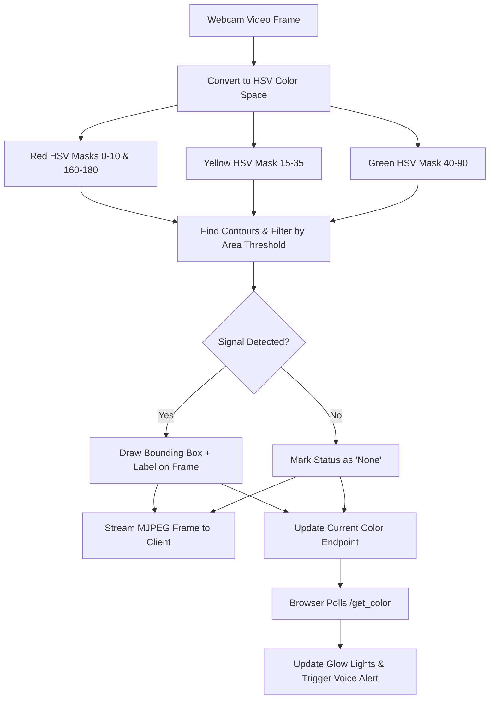

# 🚦 Real-Time AI Traffic Light Detection & Audio Alert System

[](https://www.python.org/)
[](https://flask.palletsprojects.com/)
[](https://opencv.org/)
[](https://numpy.org/)
[](https://developer.mozilla.org/en-US/docs/Web/JavaScript)
[](LICENSE)

An intelligent, real-time computer vision web application built with **Python, Flask, OpenCV, and Web Speech Synthesis API**. It analyzes live video feed, detects traffic signal states (🔴 **Red**, 🟡 **Yellow**, 🟢 **Green**) using HSV color filtering and contour detection, renders bounding boxes over the stream, and provides instantaneous voice audio alerts and visual indicators on an interactive dashboard.

---

## ✨ Features

- 📹 **Live Video Streaming:** Real-time MJPEG video streaming directly from your webcam or camera stream to the browser.
- 🎯 **HSV Color Segmentation & Detection:** Robust color range thresholding in HSV color space to distinguish Red (both lower and upper hue wraps), Yellow, and Green lights with noise filtering (contour area thresholds).
- 📦 **Visual Bounding Boxes:** Dynamic bounding box and label overlay directly rendered onto the video frame via OpenCV.
- 🔊 **Voice & Audio Alerts:** Text-to-Speech (TTS) integration using the browser's Web Speech API (`SpeechSynthesisUtterance`) that vocalizes status updates (e.g., *"Red Light Detected"*) when signal states change.
- 🎛️ **Audio Controls:** Interactive toggle to enable or disable voice announcements with audio context initialization.
- 💡 **Interactive Visual Dashboard:** Futuristic dark-mode UI with illuminated neon light indicators matching detected traffic signal states.
- ⚡ **Lightweight & Fast:** Minimal dependencies, high frame-rate processing, and responsive layout for mobile and desktop screens.

---

## 🛠️ Tech Stack

### **Backend**
- **[Python](https://www.python.org/)**: Core application logic.
- **[Flask](https://flask.palletsprojects.com/)**: Web server and streaming endpoints (`/video_feed`, `/get_color`).
- **[OpenCV (`opencv-python`)](https://opencv.org/)**: Computer vision pipeline, frame acquisition, HSV conversion, mask generation, and contour tracking.
- **[NumPy](https://numpy.org/)**: Matrix manipulation and HSV color range arrays.

### **Frontend**
- **HTML5 & CSS3**: Glassmorphic dark-theme UI with Orbitron & Roboto typography and glowing traffic light indicators.
- **JavaScript (ES6+)**: Asynchronous color state polling (`fetch('/get_color')`), DOM manipulation, and Web Speech API audio feedback.

---

## 📁 Project Structure

```plaintext
traffic-light/
│
├── static/
│   ├── script.js        # Frontend polling, UI update logic, and speech synthesis
│   └── style.css         # Modern dark neon styling & traffic light animations
│
├── templates/
│   └── index.html        # Main dashboard interface template
│
├── app.py                # Flask server, OpenCV detection pipeline, and streaming routes
├── requirements.txt      # Python package dependencies
└── README.md             # Project documentation
```

---

## 🚀 Getting Started

Follow these steps to set up and run the application locally on your machine.

### 1. Prerequisites
- **Python 3.8+** installed on your system.
- A functional webcam or connected camera.

### 2. Clone the Repository
```bash
git clone https://github.com/navyashree795/traffic-light.git
cd traffic-light
```

### 3. Create a Virtual Environment (Recommended)
```bash
# On Windows
python -m venv venv
venv\Scripts\activate

# On macOS/Linux
python3 -m venv venv
source venv/bin/activate
```

### 4. Install Dependencies
```bash
pip install -r requirements.txt
```

### 5. Run the Application
```bash
python app.py
```

### 6. Access the Dashboard
Open your browser and navigate to:
```
http://localhost:5000
```
*(Or `http://127.0.0.1:5000`)*

---

## 🔍 How It Works



1. **Frame Capture**: `cv2.VideoCapture(0)` captures live video frames.
2. **HSV Conversion**: The BGR image is converted to HSV for reliable lighting-invariant color segmentation.
3. **Thresholding**:
   - **Red:** Split into two masks (`[0, 100, 100]` to `[10, 255, 255]` & `[160, 100, 100]` to `[180, 255, 255]`).
   - **Yellow:** `[15, 100, 100]` to `[35, 255, 255]`.
   - **Green:** `[40, 50, 50]` to `[90, 255, 255]`.
4. **Contour Analysis**: Calculates contour areas and picks the largest detected signal region exceeding `500` pixels to eliminate noise.
5. **Streaming & Voice Alert**: Transmits the video feed using multipart MJPEG; the browser periodically polls `/get_color` and announces signal transitions via speech synthesis.

---

## ⚙️ Configuration & Customization

### Use an External or Mobile Camera
In [app.py](file:///c:/Users/WIN10/Desktop/my%20projects%201/traffic-light/app.py#L77), update the `VideoCapture` source:
```python
# Default webcam (index 0)
camera = cv2.VideoCapture(0)

# Secondary camera / USB webcam (index 1)
camera = cv2.VideoCapture(1)

# IP Webcam or RTSP Stream URL
camera = cv2.VideoCapture("http://192.168.1.50:8080/video")
```

### Adjust Detection Sensitivity
You can tweak the `max_area` threshold in [app.py](file:///c:/Users/WIN10/Desktop/my%20projects%201/traffic-light/app.py#L40) to filter smaller or larger colored objects:
```python
max_area = 500  # Increase to ignore smaller background objects
```

---

## 📡 API Endpoints

| Endpoint | Method | Description |
| :--- | :--- | :--- |
| `/` | `GET` | Renders the primary dashboard UI. |
| `/video_feed` | `GET` | Multipart MJPEG continuous video stream with detection overlays. |
| `/get_color` | `GET` | Returns JSON payload with the currently detected color (e.g. `{"color": "Red"}`). |

---

## 🛡️ License

Distributed under the MIT License. See `LICENSE` for more information.

---

## 💡 Acknowledgments

- [OpenCV Documentation](https://docs.opencv.org/)
- [Flask Framework](https://flask.palletsprojects.com/)
- [Web Speech API - MDN](https://developer.mozilla.org/en-US/docs/Web/API/Web_Speech_API)
